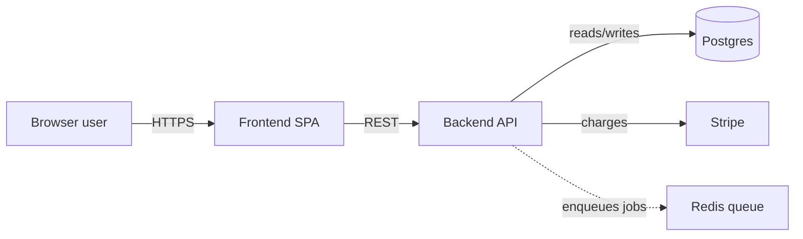
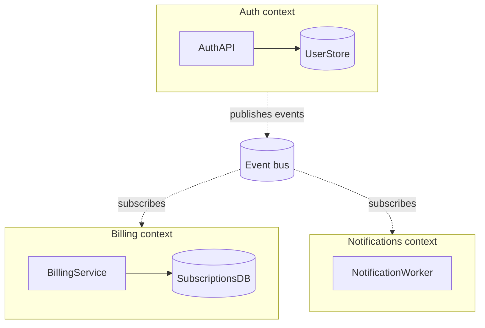
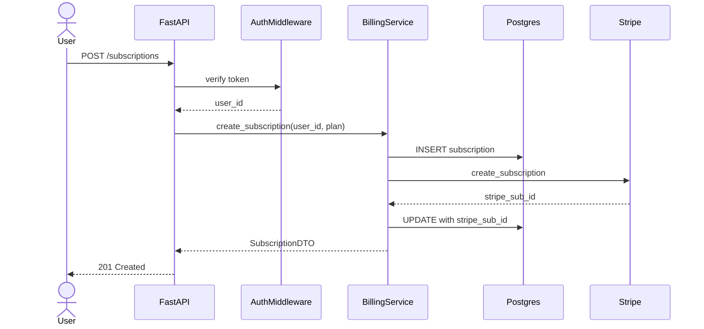
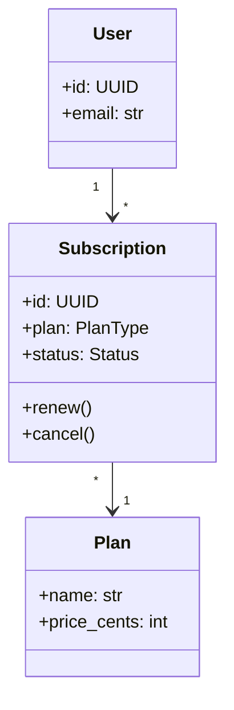
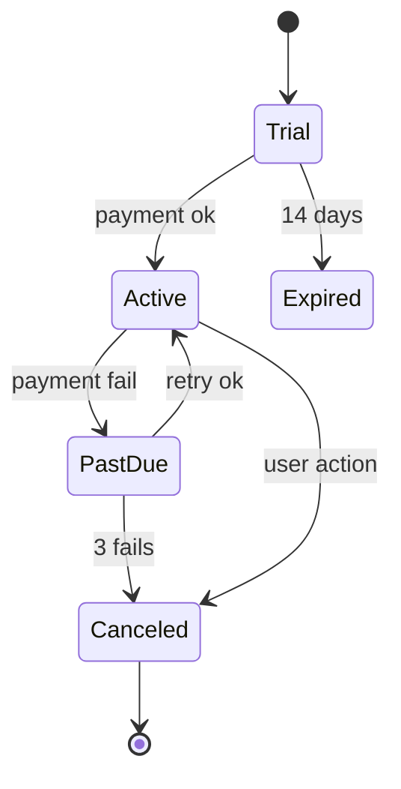
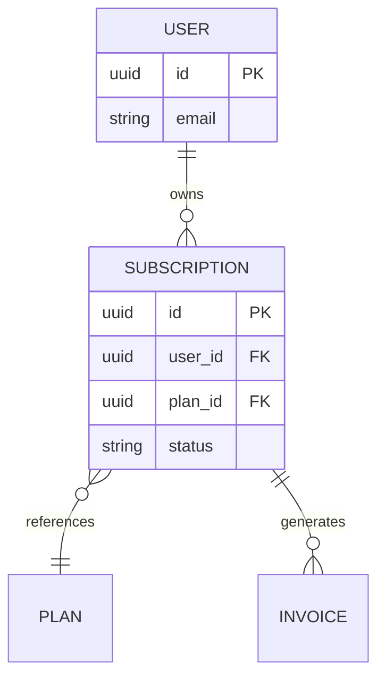

# Diagram recipes

Mermaid templates by zoom level and archetype. Hard cap: 7±2 nodes per diagram. If you need more, split.

## Mermaid type → purpose

| Zoom | Purpose | Mermaid type | Node cap |
|------|---------|--------------|----------|
| L1 Context | System + external actors | `flowchart LR` | 5–7 |
| L2 Containers | Internal high-level modules | `flowchart TB` with `subgraph` | 5–9 |
| L3 Request slice | One end-to-end flow | `sequenceDiagram` | 4–7 participants |
| L3 Domain model | Central classes/types | `classDiagram` | 5–9 |
| L3 State machine | Order/job/auth lifecycle | `stateDiagram-v2` | 5–9 |
| L3 Data schema | DB tables, message types | `erDiagram` | 5–9 entities |

Avoid `architecture-beta` — rendering is unreliable across renderers.

## Arrow conventions (consistent across all diagrams in a session)

- Solid `-->`: runtime call / data flow.
- Dotted `-.->`: depends-on / configuration / build-time.
- Thick `==>`: the **primary path** being highlighted in this view.

Color-code by category (auth, billing, etc.), not by importance. Color is a redundancy channel — also use shape or position so meaning survives colorblindness.

## Per-archetype recipes

### Backend API

- **L1**: `[Client] --> [API] --> [DB]`, plus external services (auth provider, payment, queue consumers).
- **L2**: subgraphs per bounded context (auth, billing, notifications). One queue/broker node if async. One datastore per context.
- **L3**: `sequenceDiagram` of one representative request — HTTP entry → middleware → handler → service → repository → DB → response.
- **L3 alt**: `erDiagram` for the central tables (5–9 entities, only the foreign keys that matter).

### Frontend SPA

- **L1**: `[User] --> [SPA] --> [API]`, plus CDN, auth provider, analytics.
- **L2**: subgraphs per feature area (routes/pages), state stores (Redux/Zustand/React Query), shared UI library.
- **L3**: `sequenceDiagram` from user action → component → hook → API client → backend → state update → re-render.
- **L3 alt**: `stateDiagram-v2` for auth/onboarding lifecycle.

### Data pipeline (batch or streaming)

- **L1**: `[Source] --> [Pipeline] --> [Sink]`, plus orchestrator (Airflow/Dagster) and observability.
- **L2**: subgraphs per stage (ingest, transform, enrich, load). Storage between stages (S3, Kafka, warehouse).
- **L3**: `sequenceDiagram` tracing ONE record through every stage. Show retries and dead-letter paths.

### Serverless / FaaS

- **L1**: `[Event source] --> [Functions] --> [Datastore]`, plus other event sources and downstream services.
- **L2**: cluster functions by domain. Show shared layers/utilities. IAM boundaries if relevant.
- **L3**: `sequenceDiagram` of one trigger → cold-start → handler → downstream calls → response.

### CLI tool

- **L1**: `[User shell] --> [CLI binary] --> [Local/remote resources]`.
- **L2**: subcommand structure, config loading, plugin system if present.
- **L3**: `sequenceDiagram` of one subcommand: parse → validate → execute → format output.

### Library / SDK

- **L1**: `[Consumer app] --> [Library] --> [Backing service or local resource]`.
- **L2**: public API surface vs. internal modules. Extension points.
- **L3**: `classDiagram` of the central type hierarchy. Or `sequenceDiagram` of the most common usage pattern.

### Infrastructure-as-code

- **L1**: `[Operator] --> [IaC tool] --> [Cloud provider]`, plus state backend.
- **L2**: modules/stacks grouped by environment or by resource category (network, compute, data).
- **L3**: dependency graph of a `terraform plan` for one stack. `erDiagram` for resource relationships.

### Monorepo

**Do not try to map the whole monorepo.** At Checkpoint A, force the user to pick one app/service. Then apply the recipe for that archetype.

## Templates (copy-paste, instantiate per repo)

### L1 — flowchart LR



### L2 — flowchart TB with subgraph



### L3 — sequenceDiagram (one request lifecycle)



### L3 alt — classDiagram (domain model)



### L3 alt — stateDiagram-v2 (lifecycle)



### L3 alt — erDiagram (schema)



## When Mermaid is the wrong tool

- **Directory trees**: use a fenced ASCII tree instead. More readable, lets you annotate per line.

  ```text
  src/
  ├── api/         # HTTP entry — FastAPI routes
  ├── domain/      # Pure business logic, no I/O
  ├── adapters/    # DB, queue, external API clients
  └── tasks/       # Celery workers
  ```

- **Dependency graphs with >15 nodes**: split into multiple smaller diagrams by bounded context.
- **Precise alignment / production architecture diagrams**: out of scope — this is a learning artifact, not a hand-off doc.

## Common pitfalls

- Declaring edges before nodes — declare all nodes first, edges after. Cleaner parse, easier to scan.
- Generic node IDs (`A1`, `B2`) — use self-explanatory IDs (`AUTH_API`, `USER_DB`) with `[Display Text]` for the label.
- Color-only encoding — pair color with shape or position. WCAG 1.4.1.
- One giant diagram showing "everything" — split into multiple small ones.
- Missing caption — every diagram needs a one-line "this shows X at Y zoom, focusing on Z" caption. Caption is what converts a picture into a narrative anchor.
